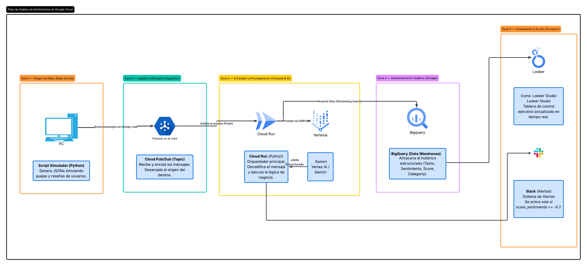

# Sistema de Monitoreo de Reputación y Alertas Críticas con IA

Un pipeline de datos End-to-End alojado en Google Cloud Platform (GCP) que automatiza la ingesta, el análisis de sentimiento mediante IA Generativa y el almacenamiento de comentarios de clientes en tiempo real.

## El Problema de Negocio
Las empresas reciben altos volúmenes de comentarios diariamente. Identificar y reaccionar a una queja crítica de forma manual toma demasiado tiempo, lo que puede escalar a una crisis de reputación. Este proyecto automatiza la clasificación de feedback en tiempo real y detona alertas automáticas ante clientes en riesgo.

## Arquitectura de la Solución
El flujo de datos está diseñado bajo una arquitectura orientada a eventos (Serverless):

1. **Pub/Sub:** Actúa como la cola de mensajería (Data Ingestion) que recibe los eventos en tiempo real.
2. **Cloud Functions (2nd Gen / Cloud Run):** Orquesta la lógica del negocio. Se activa automáticamente al recibir un mensaje.
3. **Vertex AI (Gemini 2.5 Flash):** Analiza el texto no estructurado y devuelve un JSON estructurado con el sentimiento, score, categoría y resumen.
4. **BigQuery:** Actúa como el Data Warehouse donde se almacenan los resultados de forma estructurada e histórica.
5. **Looker Studio:** Consume los datos de BigQuery para visualización ejecutiva.

## Stack Tecnológico
* **Lenguajes:** Python 3.11, SQL
* **GCP Core:** Cloud Functions, Pub/Sub, BigQuery, IAM
* **Inteligencia Artificial:** Vertex AI, Gemini Models

## Instrucciones de Ejecución
Pasos para replicar este proyecto en un entorno local y desplegarlo en GCP:

1. Clonar el repositorio.
2. Crear un entorno virtual e instalar las dependencias (`pip install -r requirements.txt`).
3. Crear un proyecto en GCP y habilitar las APIs correspondientes (Pub/Sub, Cloud Functions, Vertex AI, Cloud Build).
4. Configurar el esquema en BigQuery ejecutando el script SQL incluido.
5. Desplegar la función en GCP y ejecutar `simulador_comentarios.py` localmente para iniciar la ingesta de datos.

## 💡 Decisiones Técnicas y Lecciones Aprendidas
* Se eligió **Gemini 2.5 Flash** por su baja latencia y costo reducido en comparación con modelos más pesados, optimizando el presupuesto de la nube.
* Se configuró el parámetro `response_mime_type="application/json"` en la API de Vertex AI para garantizar que el LLM devuelva un esquema predecible y evitar fallos en la inserción a BigQuery.
